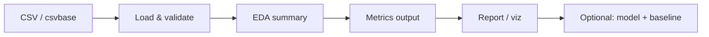

# Operationalization – How to Win RPDR

## System flow

## Target user, value proposition, deployment

- **Target user:** Portfolio reviewers, fans, and content creators interested in data-driven RPDR analysis.
- **Value proposition:** Reproducible answer to "what predicts winning RPDR?" with clear data sheet and runnable pipeline; foundation for adding episode-level data and predictive models.
- **Deployment:** Local/CLI today (`python run.py`). Optional: Streamlit or Jupyter dashboard for interactive EDA; static report or notebook export for portfolio.

## Next steps

1. **Data:** Add episode-level dataset (e.g. export from R *dragracer* or use Rupository-style CSVs) and document in `data_sheet.md`.
2. **Pipeline:** Extend `run.py` with baseline (e.g. majority class or "first-episode win" rule) and main method (classifier/rank model); report accuracy or rank correlation.
3. **Reporting:** Add 1–2 key visualizations (contestants per season, age vs placement) and wire into `run.py` or a small dashboard.
