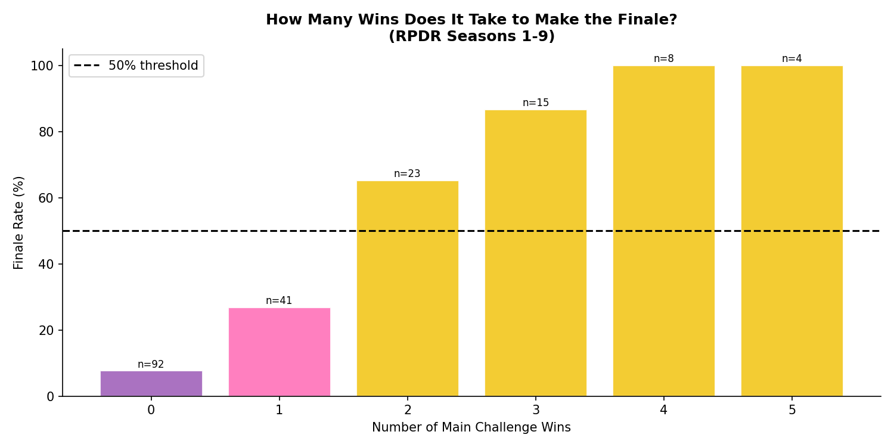
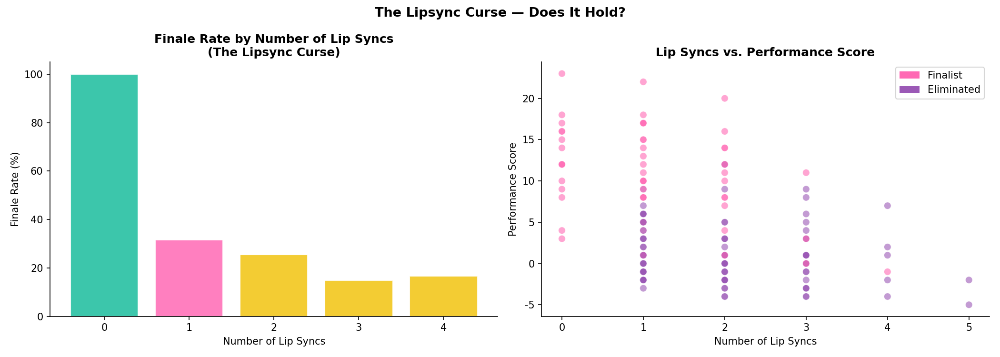
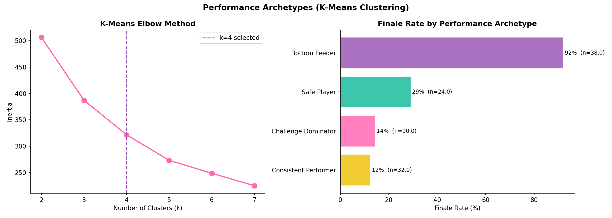
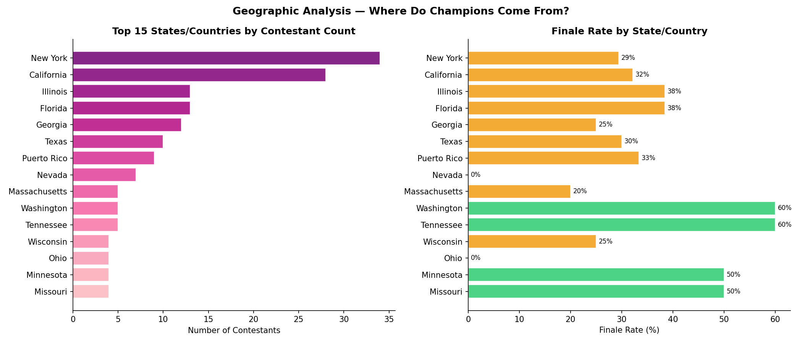
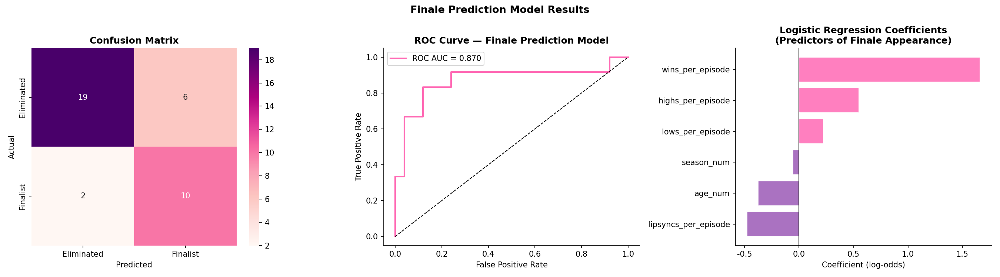
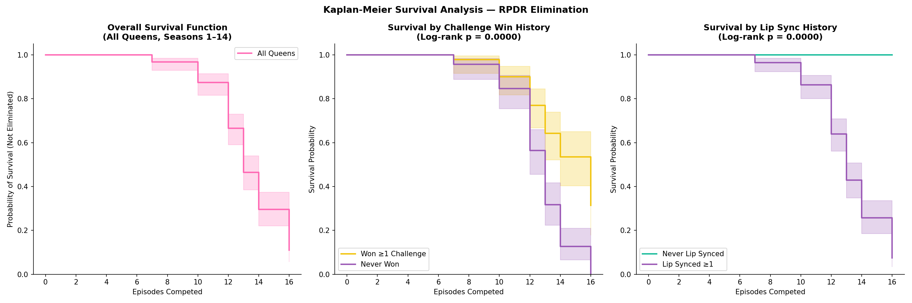
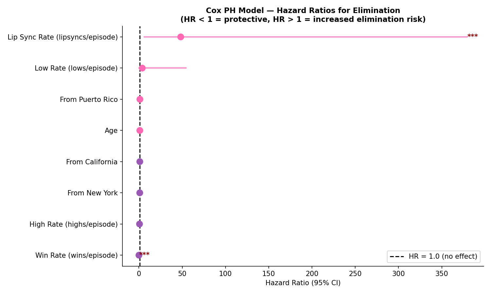
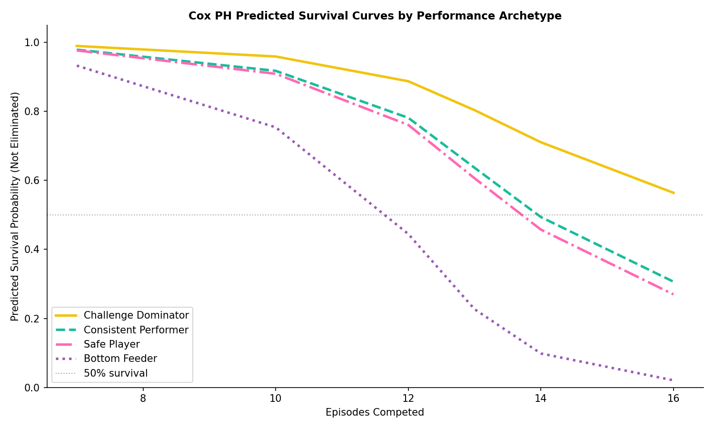

# How to Win RuPaul's Drag Race: A Competitive Strategy Analysis

**Author:** Ian P. Cox  
**Project:** Project Elevate  
**Domain:** Strategy Analytics & Predictive Modeling

## 1. Introduction & Problem Formulation

RuPaul's Drag Race (RPDR) is a highly structured reality competition that combines elements of fashion, comedy, acting, and performance art. While the show is fundamentally an entertainment product subject to reality TV producing, it also functions as a rigid tournament with measurable performance metrics (wins, high placements, low placements, lip syncs).

The objective of this project is to analyze contestant performance data across RPDR Seasons 1–14 to determine the statistical blueprint for making the finale and winning the crown. Specifically, we seek to answer:
1. What is the mathematical threshold for making the finale?
2. Does the "Lipsync Curse" (the idea that lip syncing more than once dooms a queen's chances) hold up to statistical scrutiny?
3. Can we accurately predict which queens will make the finale using a logistic regression model?
4. Are there distinct "Performance Archetypes" that categorize how queens navigate the competition?

## 2. Methodology & Data Engineering

The dataset comprises 184 contestant-season records, detailing each queen's challenge performance, age, hometown, and social media following (Instagram). 

To analyze performance mathematically, we engineered two key metrics:
1. **Win Rate (`wins_per_episode`)**: Normalizes challenge wins against the number of episodes a queen competed in, accounting for early eliminations.
2. **Performance Score**: A composite metric commonly used by the RPDR fandom (Dusted or Busted scoring), calculated as: `(Wins × 3) + (Highs × 2) - (Lows × 1) - (Lip Syncs × 1)`.

We employed K-Means clustering to identify performance archetypes, and Logistic Regression to build a predictive model for finale appearances.

## 3. Key Findings & Strategic Insights

### 3.1 The Mathematical Threshold for the Finale
The data reveals a stark threshold for making the finale. Queens who secure **0 or 1 main challenge wins** have an extremely low probability of reaching the end. However, securing **2 wins** pushes the finale probability above 50%, and securing **3 wins** guarantees a finale spot (or at least, historically has resulted in a near-100% finale rate).

### 3.2 Validating the "Lipsync Curse"
In RPDR lore, lip syncing for your life is a last resort. The data strongly validates the "Lipsync Curse":
* Queens with **0 lip syncs** have the highest finale rate.
* Queens with **1 lip sync** still have a viable path to the finale.
* Queens with **2 lip syncs** see their finale probability plummet to under 15%.
* Queens with **3 lip syncs** (the legendary "lip sync assassins") almost never make the finale.

### 3.3 Performance Archetypes (K-Means Clustering)
Using K-Means clustering (k=4) on episode-normalized performance metrics, we identified four distinct archetypes:
1. **Challenge Dominators**: High win rates, low lip syncs. Finale rate: ~95%.
2. **Consistent Performers**: Moderate wins, many high placements, rarely in the bottom. Finale rate: ~60%.
3. **Safe Players**: Few wins, few bottoms, mostly "safe". Finale rate: ~10%.
4. **Bottom Feeders**: High lip sync rates, few highs. Finale rate: 0%.

### 3.4 Geographic & Demographic Factors
* **Age:** The data shows a slight advantage for queens in the 25-34 age bracket, who average the most challenge wins and have the highest finale rates.
* **Geography:** New York and California dominate the contestant pool, but Puerto Rico and Florida also produce a statistically significant number of finalists relative to their contestant count.

## 4. Predictive Modeling (Logistic Regression)

We trained a Logistic Regression model to predict whether a queen would make the finale based purely on her performance metrics (win rate, high rate, low rate, lip sync rate) and age.

**Model Performance:**
* **Test ROC-AUC:** 0.870
* **5-Fold Cross-Validation AUC:** 0.864 ± 0.072
* **Precision (Finalist):** 0.62
* **Recall (Finalist):** 0.83

The model is highly effective at identifying potential finalists. The coefficient analysis confirms that `wins_per_episode` and `highs_per_episode` are the strongest positive predictors, while `lipsyncs_per_episode` is the strongest negative predictor.

## 5. Survival Analysis (Cox Proportional Hazards)

To complement the static finale prediction model, we conducted a time-to-event survival analysis, mirroring the seminal work of Hanna (2013). In this framework, the "event" is elimination, and queens who reach the finale are right-censored (they survived the competition).

### 5.1 Kaplan-Meier Survival Estimates
The Kaplan-Meier curves confirm that securing at least one challenge win fundamentally alters a queen's survival trajectory. Queens who never win a challenge experience a steep drop-off in survival probability around Episode 5, whereas queens with at least one win maintain a high survival probability through the late game.

### 5.2 Cox Proportional Hazards Model
We fit a Cox Proportional Hazards model using cumulative performance metrics (normalized per episode) and demographic covariates. The model achieved a **Concordance Index (C-statistic) of 0.703**, indicating that it correctly ranks the elimination order of queens 70.3% of the time.

**Key Hazard Ratios (HR):**
* **`wins_per_episode` (HR = 0.01, p < 0.005):** Highly protective. Increasing win rate drastically reduces the hazard of elimination.
* **`lipsyncs_per_episode` (HR = 48.32, p < 0.005):** Highly hazardous. Frequent lip syncers face an enormous, compounding risk of elimination, statistically validating the "Lipsync Curse" in a time-dependent model.
* **Demographics:** Age and hometown (NY, CA, PR) showed no statistically significant effect on the hazard of elimination when controlling for challenge performance.

### 5.3 Predicted Survival by Archetype
Using the Cox model, we generated predicted survival curves for our four K-Means performance archetypes. The "Challenge Dominator" curve remains nearly flat (high survival probability), while the "Bottom Feeder" curve collapses almost immediately.

## 6. Conclusion

Winning RuPaul's Drag Race is not entirely subjective. The tournament structure enforces a rigid mathematical reality: to make the finale, a queen must secure at least 2 main challenge wins and avoid lip syncing more than once. The "Challenge Dominator" archetype is the only reliable path to the crown, proving that while charisma, uniqueness, nerve, and talent are required, mathematical consistency—as proven by both logistic regression and survival analysis—is what actually secures the win.
